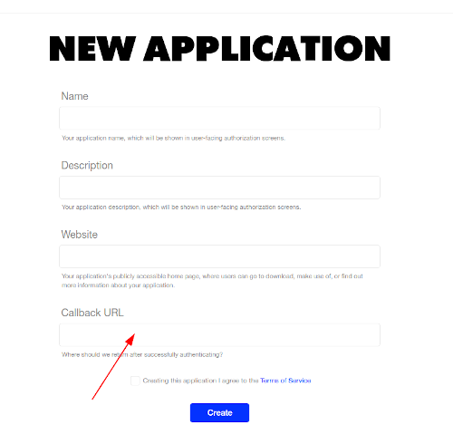

# coubdl

## Description

coubdl is a command line tool that downloads your liked coubs from https://coub.com.
I wrote this tool to archive my favorite coubs to never lose them and to be able to search them faster.
Coubs are an amazing invention, and I would be very sad if they disappeared :-)

coubdl uses official coub API and needs authentification to be able to work. Authentication is very simple,
but you would need to register your "app" at https://coub.com. Don't worry, it's very easy to do.

## Usage

### Registering your coub app

Go to https://coub.com/dev/applications/ and create a new app with any name you like, but put
http://localhost:8080/callback in "Callback URL" field.



You will get two strings that you would need:

* Application ID
* Secret


### Install coubdl

You can download latest coubdl from releases page or use go get to install it

```bash
# go get -u github.com/mkevac/coubdl
```

### Using coubdl

Run coubdl, optionally giving it path to directory you want your coubs saved.

```bash
$ coubdl -dir ~/Downloads/coubs
Downloading coub list from site...
  99% |███████████████████████████████████████ | [25s:0s]             
Downloading 1204 coubs to '/home/marko/Downloads/coubs'...
 100% |████████████████████████████████████████| [100s:0s]            
```

If this your first time running the tool, you would be asked for Application ID and Secret optained previously.
If not, coubdl will start downloading your liked coubs.
After it finished downloading, it will open your browser to newly created index.html file that contains neat table
with all your favorite coubs.

At the end, directory will contain several files:
* index.html with all your coubs in a neat table useful for searching
* For each coub you will find
  * Ready made video with audio included, but clipped according to video length
  * High quality video without audio
  * High quality full length audio